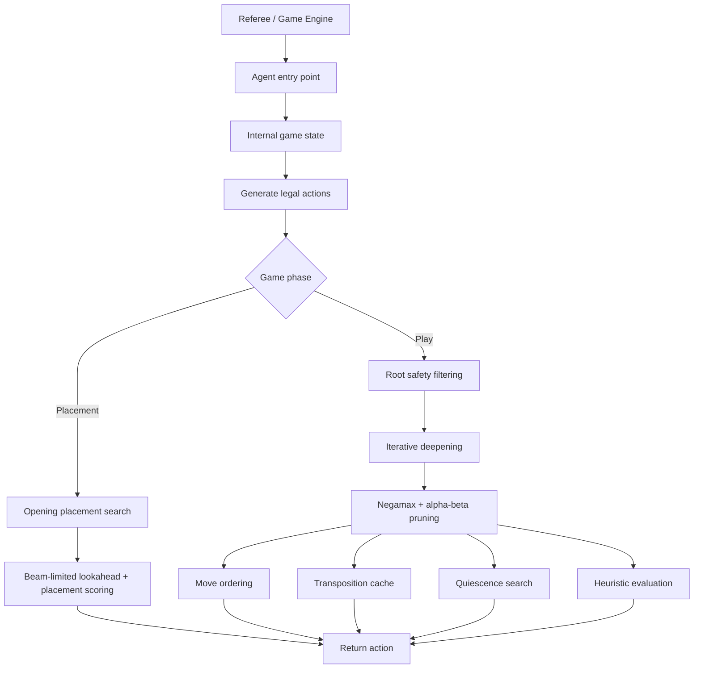

# Cascade AI Agent

A two-player game-playing agent for **Cascade**, implemented in Python with adversarial search, heuristic evaluation, and game-specific tactical safeguards.

This project was originally developed for **COMP30024 Artificial Intelligence** at the University of Melbourne. The repository has been cleaned for portfolio and reproducibility use: personal submission metadata has been removed, while the supplied referee framework is retained so the project can be cloned and run locally.

## Architecture



## Main Techniques

| Component | Purpose |
| --- | --- |
| **Iterative deepening** | Searches progressively deeper while retaining the best fully completed result. |
| **Negamax + alpha-beta pruning** | Performs adversarial search while pruning branches that cannot affect the final decision. |
| **Move ordering** | Searches promising actions first to improve pruning efficiency. |
| **Transposition cache** | Reuses results for previously explored board states. |
| **Quiescence search** | Extends tactically unstable leaf positions using forcing moves to reduce horizon effects. |
| **Heuristic evaluation** | Scores non-terminal states using material, mobility, tower structure, tactical opportunities, vulnerability, edge risk, centre control, cascade potential, and endgame factors. |
| **Opening search** | Uses a separate placement-phase search with beam-limited lookahead and position-specific scoring. |
| **Tactical safety filters** | Rejects clear one-move losses and selected self-damaging root actions before the main search. |
| **Time-aware fallback** | Keeps a legal greedy fallback and returns the best completed search result when close to the time limit. |

## Repository Structure

```text
cascade_agent/
├── agent/              # Student-developed game-playing agent
│   ├── program.py      # Agent entry point
│   ├── state.py        # Internal board-state handling
│   ├── movegen.py      # Legal action generation
│   ├── opening.py      # Placement-phase search
│   ├── negamax.py      # Main adversarial search
│   ├── evaluate.py     # Heuristic evaluation
│   ├── clean_search.py # Root-level tactical filtering
│   ├── red_safety.py   # Additional first-player tactical safeguards
│   └── greedy.py       # Lightweight fallback policy
├── referee/            # Supplied COMP30024 referee / game framework
├── report.pdf          # Project report
├── README.md
└── .gitignore
```

> `referee/` is the supplied course framework and is included only to make the project directly runnable. The main implementation in this repository is under `agent/`.

## Quick Start

### Requirements

- Python **3.12** recommended
- No additional third-party Python packages are required by the agent itself

### Clone

```bash
git clone https://github.com/Chuan1130/cascade_agent.git
cd cascade_agent
```

### Run an agent-vs-agent game

From the repository root:

```bash
python -m referee agent agent
```

This launches the included referee with two instances of the agent playing against each other.

To see the referee's available command-line options:

```bash
python -m referee --help
```

## Decision Pipeline

### 1. Placement phase

During the opening placement phase, the agent does not use the normal mid-game Negamax search. Instead, it scores candidate placements using factors such as centrality, connectivity, opponent-space restriction, and opening shape, then applies a small lookahead search over a beam-limited candidate set.

### 2. Play phase

Once normal play begins, the agent first generates legal actions and applies conservative root-level safety checks. The remaining actions are passed to iterative-deepening Negamax with alpha-beta pruning.

The search uses:

- previous-depth best-move preference,
- action-ordering memory,
- transposition-table bounds,
- forcing-move quiescence search,
- colour-specific tactical adjustments,
- repetition and endgame handling,
- a deadline-aware early exit.

### 3. Evaluation

At non-terminal search leaves, the evaluation function combines a weighted feature vector. Important signals include:

- token/material advantage,
- number and shape of stacks,
- mobility,
- useful stack height,
- immediate captures,
- vulnerability to capture,
- edge exposure,
- centre control,
- cascade opportunities,
- turn-limit pressure,
- repetition behaviour,
- endgame conversion quality.

Terminal positions bypass the heuristic and receive direct win/loss/draw scores.

## Report

The original project report is retained as [`report.pdf`](./report.pdf) for a more detailed discussion of the development process and evaluation.

## Attribution

The **agent implementation** is the project work contained in `agent/`. The **referee/game framework** under `referee/` was supplied for COMP30024 and is retained for local execution and reproducibility.

No licence is asserted here over the supplied course framework.